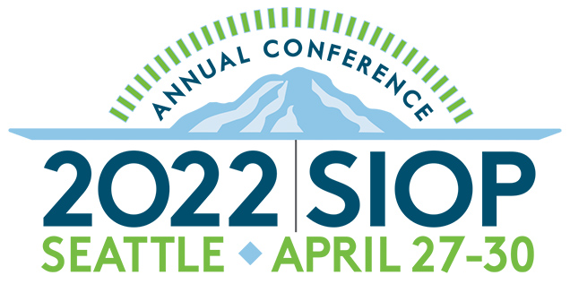

```{r setup, include=FALSE}
knitr::opts_chunk$set(echo = FALSE)
```

```{css, echo=FALSE}
.main_pic {
  border-radius: 50%;
  width: 90%;
  vertical-align: top;
}

.main-img-right {
  width: 100%;
}

.new-img-right {
  position: absolute;
  bottom: 100px;
  right: 150px;
  width: 1500px;           /* Play with width and height specifications if image stretches*/
  height: 800px;
}

.new-img-left {
  position: absolute;
  bottom: 100px;
  left: 100px;
  width: 1200px;           /* Play with width and height specifications if image stretches*/
  height: 1100px;
}

.new-img-top {
  position: absolute;
  top: 100px;
  left: 100px;
  width: 1200px;           
  height: 100px;
}

p.caption {
  font-size: .9em;         /* This sets figure caption font size */
  text-align: left
}

```

```{r data, include = FALSE}
data <- read.csv("SIOPcleaned.csv")      ## from "datacleaning.R" script

## Study 2 DVs

data$item387      <- 7- data$item387           ## only reflected engagement item

data$absorption   <- rowMeans(data[c(380:386)], na.rm=TRUE)
data$vigor        <- rowMeans(data[c(387:392)], na.rm=TRUE) 
data$dedication   <- rowMeans(data[c(393:399)], na.rm=TRUE) 

data$cognitive    <- rowMeans(data[c(380:382, 387:388, 393:395)], na.rm=TRUE)
data$affective    <- rowMeans(data[c(383:384, 389:390, 396:397)], na.rm=TRUE) 
data$behavioral   <- rowMeans(data[c(385:386, 391:392, 398:399)], na.rm=TRUE) 

######################################################

data$burnout      <- rowMeans(data[c(373:376)], na.rm=TRUE)
data$stress       <- rowMeans(data[c(377:379)], na.rm=TRUE)
data$engagement   <- rowMeans(data[c(380:399)], na.rm=TRUE)        ## added 10/12 because analyses too wonky with 3 subscales

alpha.abs <- psych::alpha(data[c(380:386)])
alpha.vig <- psych::alpha(data[c(387:392)])
alpha.ded <- psych::alpha(data[c(393:399)])
alpha.eng <- psych::alpha(data[c(380:399)])

alpha.bur <- psych::alpha(data[c(373:376)])
alpha.str <- psych::alpha(data[c(377:379)])


## O*NET categories

data$onet.resource.ii <- rowMeans(data[c(162:166)], na.rm=TRUE)
data$onet.resource.mp <- rowMeans(data[c(167:176)], na.rm=TRUE)
data$onet.resource.wo <- rowMeans(data[c(177:185)], na.rm=TRUE)
data$onet.resource.io <- rowMeans(data[c(186:202)], na.rm=TRUE)
data$onet.resource.ir <- rowMeans(data[c(149:161)], na.rm=TRUE)
data$onet.resource.pc <- rowMeans(data[c(128:144,146:148)], na.rm=TRUE)
data$onet.resource.sc <- rowMeans(data[c(118:127)], na.rm=TRUE)

overall.resource <- rowMeans(data[c(118:144,147:202)], na.rm=TRUE)

data$onet.hindrance.ii <- rowMeans(data[c(246:247,249:252)], na.rm=TRUE)
data$onet.hindrance.mp <- rowMeans(data[c(252:261)], na.rm=TRUE)
data$onet.hindrance.wo <- rowMeans(data[c(262:270)], na.rm=TRUE)
data$onet.hindrance.io <- rowMeans(data[c(271:287)], na.rm=TRUE)
data$onet.hindrance.ir <- rowMeans(data[c(233:245)], na.rm=TRUE)
data$onet.hindrance.pc <- rowMeans(data[c(213:232)], na.rm=TRUE)
data$onet.hindrance.sc <- rowMeans(data[c(203:212)], na.rm=TRUE)

overall.hindrance <- rowMeans(data[c(203:247,249:287)], na.rm=TRUE)

data$onet.challenge.ii <- rowMeans(data[c(332:336)], na.rm=TRUE)
data$onet.challenge.mp <- rowMeans(data[c(337:346)], na.rm=TRUE)
data$onet.challenge.wo <- rowMeans(data[c(347:355)], na.rm=TRUE)
data$onet.challenge.io <- rowMeans(data[c(356:372)], na.rm=TRUE)
data$onet.challenge.ir <- rowMeans(data[c(319:331)], na.rm=TRUE)
data$onet.challenge.pc <- rowMeans(data[c(298:307,309:318)], na.rm=TRUE)
data$onet.challenge.sc <- rowMeans(data[c(288:297)], na.rm=TRUE)

overall.challenge <- rowMeans(data[c(288:307,309:372)], na.rm=TRUE)


library(tidyverse)  
library(corrr)

## Resource:

mydata <- data[,c(413, 411:412, 414:420)]

res.cor <- correlate(mydata)

res.cor %>% fashion()

res.cor %>% rearrange(method="MDS", absolute=FALSE) %>% shave(upper=FALSE) %>% rplot()

res.cor %>% network_plot(min_cor = .4)

library(corrplot)

new <- cor(data[,c(412:421)], use="complete.obs") ## redid 2/14/22

## changing O*NET categories for prettier labels - 2/14/22
colnames(new) <- c("Burnout", "Stress", "Engagement", "Info Input", "Mental Proc", "Work Output", "Interaction", "Interpersonal", "Physical Cond", "Structure")
rownames(new) <- c("Burnout", "Stress", "Engagement", "Info Input", "Mental Proc", "Work Output", "Interaction", "Interpersonal", "Physical Cond", "Structure")

corrplot(new, type="upper", order="hclust", tl.col="black", tl.srt=45, diag=FALSE)

## Challenge:


mydata <- data[,c(412:414, 428:434)]

res.cor <- correlate(mydata)

res.cor %>% rearrange(method="MDS", absolute=FALSE) %>% shave(upper=FALSE) %>% rplot()

res.cor %>% network_plot(min_cor = .4)

new2 <- cor(data[,c(412:414, 429:435)], use="complete.obs")

## changing O*NET categories for prettier labels - 2/14/22
colnames(new2) <- c("Burnout", "Stress", "Engagement", "Info Input", "Mental Proc", "Work Output", "Interaction", "Interpersonal", "Physical Cond", "Structure")
rownames(new2) <- c("Burnout", "Stress", "Engagement", "Info Input", "Mental Proc", "Work Output", "Interaction", "Interpersonal", "Physical Cond", "Structure")

corrplot(new2, type="upper", order="hclust", tl.col="black", tl.srt=45, diag=FALSE)

## Hindrance:

mydata <- data[,c(413, 411:412, 421:427)]

res.cor <- correlate(mydata)

res.cor %>% rearrange(method="MDS", absolute=FALSE) %>% shave(upper=FALSE) %>% rplot()

res.cor %>% network_plot(min_cor = .4)

new3 <- cor(data[,c(412:414, 422:428)], use="complete.obs")

## changing O*NET categories for prettier labels - 2/14/22
colnames(new3) <- c("Burnout", "Stress", "Engagement", "Info Input", "Mental Proc", "Work Output", "Interaction", "Interpersonal", "Physical Cond", "Structure")
rownames(new3) <- c("Burnout", "Stress", "Engagement", "Info Input", "Mental Proc", "Work Output", "Interaction", "Interpersonal", "Physical Cond", "Structure")

corrplot(new3, type="upper", order="hclust", tl.col="black", tl.srt=45, diag=FALSE)

```

```{r ResourPlot, include = FALSE}

svg("ResourPlot.svg")
corrplot(new, type="upper", order="hclust", tl.col="black", tl.srt=45, diag=FALSE)
dev.off()

```

```{r ChallPlot, include = FALSE}

svg("ChallPlot.svg")
corrplot(new2, type="upper", order="hclust", tl.col="black", tl.srt=45, diag=FALSE)
dev.off()

```

```{r HinderPlot, include = FALSE}

svg("HinderPlot.svg")
corrplot(new3, type="upper", order="hclust", tl.col="black", tl.srt=45, diag=FALSE)
dev.off()

```

# Introduction
Research on the job demands-resources theory [@bakker2017job] highlights the importance of work characteristics on the experience of motivation and strain, which in turn have an impact on job performance. We extend these perspectives to include challenge and hindrance demands. This study explores how these work experiences empirically relate to different work outcomes. We propose that:

> **`Hypothesis 1:`** Job characteristics appraised as resources will be positively associated with engagement, and negatively associated with stress and burnout.

> **`Hypothesis 2:`** Job characteristics appraised as challenge demands will be positively associated with engagement, and negatively associated with stress and burnout.

> **`Hypothesis 3:`** Job characteristics appraised as hindrance demands will be negatively associated with engagement, and positively associated with stress and burnout.

# Methods
We evaluated associations between the antecedents and proximal outcomes of the Job Demands-Resources model [@bakker2017job; @bakker2003dual; @demerouti2001job], within the unifying framework of O\*Net. Specifically, focusing on the relationship between job characteristics and employee levels of job engagement, stress, and burnout. Our sample consists of 568 Prolific Panel participants.

We examined job characteristics based on O\*Net's subcategories under work activity and work context. Burnout ($\alpha$ = `r round(alpha.bur$total$raw_alpha, 2)`) and stress ($\alpha$ = `r round(alpha.str$total$raw_alpha, 2)`) were measured using the Copenhagen Psychosocial Questionnaire [@burr_third_2019], and an overall engagement score was measured using an 18-item measure [@engage_2022] ($\alpha$ = `r round(alpha.eng$total$raw_alpha, 2)`). To create this poster, we used `posterdown` version `r packageVersion("posterdown")` [@R-posterdown].

# Results
The average perception that an O\*Net job element could be considered a resource was 3.77 with a standard deviation of 0.48. That it could be considered a challenge was 3.75 with a standard deviation of 0.50. Lastly, the average perception that it could be considered a hindrance was 2.39 with a standard deviation of 0.78.

```{r dvplot, out.width="100%", fig.cap="Distributions of focal variables of interest."}

library(ggplot2)
library(tidyr)

forplot <- gather(data, Variable, Value, burnout:engagement, factor_key=TRUE)

ggplot(forplot, aes(x = Value, fill = Variable)) +
  geom_density(alpha = .5) +
  scale_fill_manual(values=c("#2166ac", "#d1e5f0", "#b2182b")) + 
  xlab("Dependent Variable Values") + labs(fill = "Dependent\nVariable") 

```

The figure in the center shows the relationships among resource dimensions (O*Net categories) as well as the three focal outcome variables. Regression analyses reveal that the more a work characteristic is perceived as a resource, the more engaged is the respondent ($R^2$ = .15, $F_{(7, 528)}$ = 12.82, $p$ < .001). Figure \@ref(fig:ChallengePlot2) shows the relationships among challenge demands and the three focal outcome variables. The impact of challenge demands on engagement was similar in direction and magnitude to that of resources ($R^2$ = .13, $F_{(7, 528)}$ = 11.03, $p$ < .001), with null effects for both stress ($R^2$= .01, $F_{(7, 528)}$ = 0.88, $p$ = .520) and burnout ($R^2$ = .02, $F_{(7, 528)}$ = 1.21, $p$ = .295). Figure \@ref(fig:HinderPlot2) shows the relationships among hindrance demands and the three focal outcome variables. Regression analyses revealed a marginal association between a work characteristic perceived as a hindrance and lower levels of engagement ($R^2$ = .07, $F_{(7, 528)}$ = 5.84, $p$ < .001), with similar effects both between being viewed as a hindrance and increased stress ($R^2$ = .06, $F_{(7, 528)}$ = 4.88, $p$ < .001) and burnout ($R^2$ = .06, $F_{(7, 528)}$ = 4.90, $p$ < .001).


```{r ChallengePlot2, out.width="100%", fig.cap="Challenge demand ratings (O*Net characteristic category association)."}

corrplot(new2, type="lower", order="hclust", tl.col="black", tl.srt=45, diag=FALSE)

```

```{r HinderPlot2, out.width="100%", fig.cap="Hindrance demand ratings (O*Net characteristic category association)."}
 
corrplot(new3, type="lower", order="hclust", tl.col="black", tl.srt=45, diag=FALSE)

```

# Discussion 
Largely aligning with the job-demands resources theory [@demerouti2001job], our results indicated that work characteristics perceived as resources were associated with greater engagement. Similarily,  characteristics perceived as challenge demands were associated with higher engagement. Further, job characteristics deemed hindrance demands were associated with lower engagement, higher stress, and greater burnout. 

These results support prior research on the potential impact of challenge stressors on work outcomes [@cavanaugh2000empirical; @podsakoff2007differential]. Our results highlight the importance in noting the distinction between types of demands in future research and practice. Employers would benefit from understanding what work demands may be perceived as challenges, and leveraging them to increase desired work outcomes (e.g., engagement). 

```{r img-with-knitr, echo=FALSE, fig.align='right', out.width='45%', eval=TRUE}



```

```{r, include=FALSE}
knitr::write_bib(c('knitr','rmarkdown','posterdown','pagedown'), 'packages.bib')
```